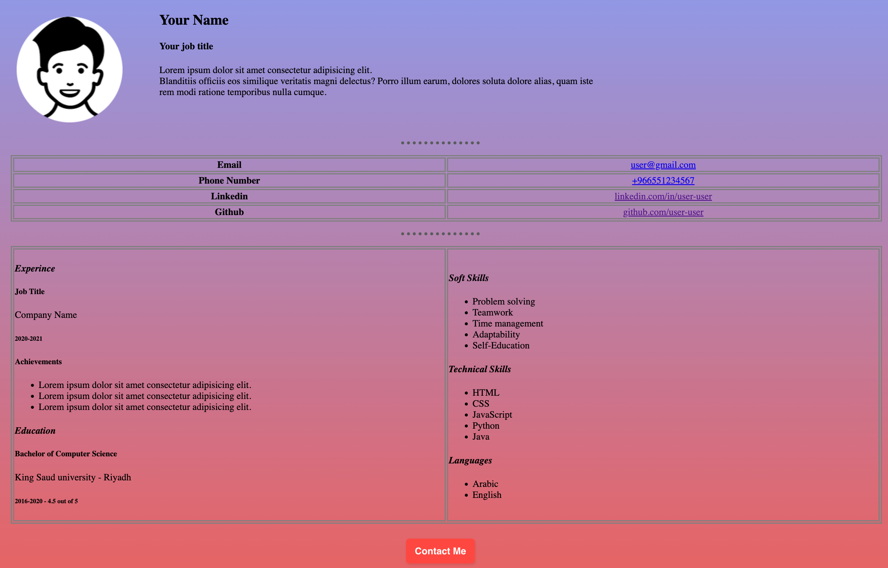
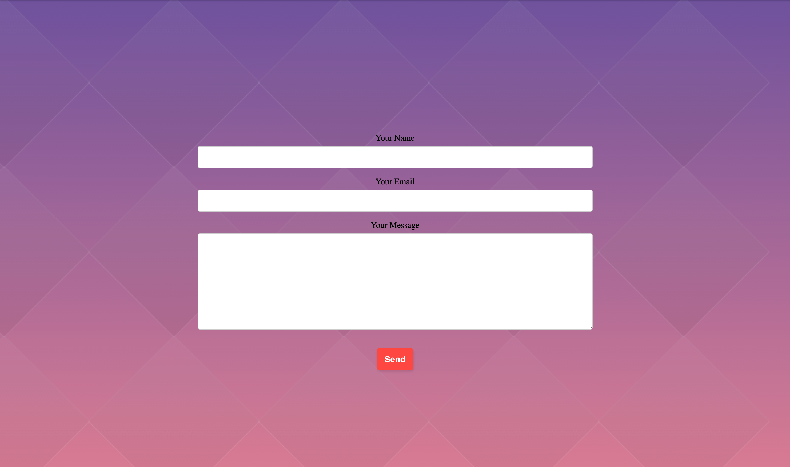

# HTML-CSS-Project

### Home page expected design

### Contact me page expected design

#### Requirements:
- Use HTML boilerplate Templete
- Change title for the two pages
- Use external CSS
- Use background-color & background-image
- Use position with the first section to make details next to image
- Use margin and padding and height and width to orgnize your webpage
- Use comments in both HTML & CSS
- Use meaningful classes or ids names
- Use headings tags
- Use paragraph tag
- Use hr tag and customize it
- Use br tag
- Use em & strong tags
- Use table tag 
- Use ol tag or ul tag
- Use a tag to redirect the user to your github & linkedin & your email and phone number
- Use form, label, input and textarea tags to build contact me form
- Use button tag and customize it, also your button should redirect the user to the contact-me page
- Deploy your app using Github pages
- Use Google font

#### Grading criteria:

| # | Req | Score
| :---: | :---: |  :---: |
| 1 | Image  | 10
| 2 | Links   | 10
| 3 | Table   | 10
| 4 | Lists   | 10
| 5 | Buttons  | 10
| 6 | Form  | 10
| 7 | Background  | 10
| 8 | Use Google fonts  | 10
| 9 | Use position as in the requirements | 10
| 10 | Deployment in Github pages  | 10

